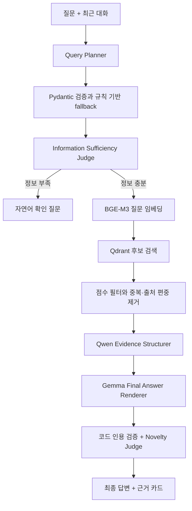

# Knowledge Hub LLM/RAG 발전 과정

## 문서 목적

이 문서는 Knowledge Hub의 LLM 기능이 단순한 로컬 모델 호출에서 질문 이해, 근거 검색, 주장 검증, 정보 충족도 판정까지 발전한 과정을 기록한다. 새로운 기능 목록만 나열하지 않고, 각 단계에서 어떤 문제가 있었고 왜 다음 구조가 필요했는지를 중심으로 정리한다.

Git 이력상 RAG 핵심 코드는 2026년 9월 2일 `0afd441` 커밋에서 하나의 기능 단위로 공개됐다. 따라서 그 이전의 단계는 개별 커밋 순서가 아니라 현재 코드와 설계 문서에서 확인할 수 있는 논리적 발전 과정이다. 이후 변경은 실제 문제 사례와 함께 계속 이 문서에 추가한다.

## 출발점: 일반 LLM 답변의 한계

초기 목표는 직접 작성한 제조·AI 기술 게시물을 다시 찾고 여러 글을 연결해 학습에 활용하는 것이었다. 일반 LLM은 자연스러운 답변을 만들 수 있지만, 다음 문제가 있었다.

- 답변이 내 자료에서 나온 것인지 확인하기 어렵다.
- 게시글이 수정되거나 삭제되어도 모델의 답변과 자동으로 동기화되지 않는다.
- 자연스러운 문장이 실제 원문보다 강한 주장으로 확대될 수 있다.
- 기술 자료를 외부 API로 보내지 않고 로컬에서 처리할 필요가 있다.

이 문제를 해결하기 위해 “유창함보다 검증 가능성”과 “원본 데이터와 검색 인덱스의 책임 분리”를 핵심 원칙으로 정했다.

## 1단계: 로컬 LLM 실행 환경

첫 단계에서는 LM Studio의 OpenAI 호환 API를 통해 Qwen3 8B 모델을 호출하는 구조를 만들었다. 기술 원문을 외부 서비스로 전송하지 않으면서도 FastAPI에서 일반적인 Chat Completions 방식으로 모델을 사용할 수 있게 했다.

구성은 다음과 같다.

- LM Studio: 호스트에서 로컬 LLM 실행
- Qwen3 8B: 질문 분석과 답변 생성
- FastAPI: 모델 호출과 RAG 파이프라인 오케스트레이션
- Docker Compose: 애플리케이션 서비스 통합 실행

로컬 실행으로 데이터 통제권을 확보했지만, 작은 모델이 긴 지시를 놓치거나 JSON 형식을 어길 수 있고 한 질문에 여러 차례 모델을 호출하면 응답 시간이 길어진다는 제약도 함께 생겼다.

## 2단계: 벡터 검색을 이용한 근거 연결

LLM의 내부 지식만으로 답하지 않도록 게시글을 검색 가능한 지식으로 변환했다.

1. 게시글 본문을 검색 단위의 청크로 분할한다.
2. BGE-M3로 각 청크의 1024차원 임베딩을 생성한다.
3. 임베딩과 원문 위치 정보를 Qdrant에 저장한다.
4. 질문 임베딩과 가까운 청크를 검색한다.
5. 선택된 원문만 LLM의 참고 지식으로 전달한다.

MySQL은 게시글 원본의 기준 저장소이고 Qdrant는 언제든 다시 만들 수 있는 검색 인덱스다. 게시글 생성·수정·삭제 시 벡터도 함께 생성·교체·삭제해 두 저장소의 생명주기를 맞췄다.

## 3단계: 근거의 양보다 다양성 확보

초기 유사도 검색에서는 한 게시글의 인접 청크가 높은 점수를 함께 받아 결과를 독점할 수 있었다. 그러면 여러 문서를 종합해야 하는 질문도 사실상 한 글만 참고하게 된다.

이를 개선하기 위해 검색 후보를 요청 수보다 넓게 가져온 뒤 다음 규칙을 적용했다.

- 내용이 동일한 청크 제거
- 한 출처에서 선택할 수 있는 청크 수 제한
- 최소 유사도 미만의 청크 제외
- 최종 선택 순서대로 `[근거 N]` 번호 부여

이 단계에서 검색 결과를 많이 가져오는 것보다 서로 다른 출처에서 직접 도움이 되는 근거를 구성하는 것이 중요하다는 기준이 생겼다.

## 4단계: 질문을 먼저 이해하는 Query Planner

벡터 검색만으로는 “그건 왜 그런 거야?” 같은 후속 질문을 정확히 처리할 수 없다. 대명사와 생략된 대상이 그대로 검색어가 되면 이전 대화의 핵심 대상이 사라지기 때문이다.

Query Planner를 추가해 최근 대화와 현재 질문을 다음 구조로 분석하도록 했다.

- 질문 의도
- 사용자의 실제 목표
- 문맥을 복원한 독립 질문
- 핵심 대상과 제약 조건
- 필요한 하위 작업
- 추가 확인이 필요한 모호한 표현

LLM 출력은 Pydantic 스키마로 검증한다. JSON 생성에 실패하면 규칙 기반 분석으로 전환하고, 대상을 확정할 수 없는 대명사가 있으면 검색하지 않고 자연어 확인 질문을 반환한다.

## 5단계: 생성과 검증의 역할 분리

검색 근거를 제공해도 생성 모델은 관련된 내용을 직접적인 근거처럼 확대하거나, 원문에 없는 장단점과 성공 가능성을 덧붙일 수 있었다. 하나의 프롬프트에 답변 생성과 검증을 모두 맡기는 대신 역할을 분리했다.

- Answer Renderer: 질문에 직접 답하는 자연스러운 초안 생성
- Claim Judge: 초안의 각 주장과 원문을 다시 대조
- 인용 필터: `[근거 N]`이 없는 사실 주장 블록 제거
- 인용 정리: 근거 번호를 문장의 주어로 읽는 표현을 문장 끝 인용으로 변환

실행 조언과 원문 사실도 구분한다. 원문에서 확인되는 기술 사실에는 인용을 요구하지만, 새로운 기술 사실을 추가하지 않는 일반적인 다음 행동은 `제안:` 또는 `다음 단계:`로 표시할 수 있다.

## 6단계: 설계와 신규성 판단 정책 분리

“기존 기술을 조합하면 새로운 알고리즘인가?”와 같은 질문에는 검색된 사례만 요약해서는 충분하지 않다. 이에 Novelty Judge를 추가해 다음 경계를 일관되게 적용했다.

- 기존 구성 요소의 연결·순서·데이터 흐름 변화: 아키텍처 조합 또는 변형
- 계산 연산자·손실함수·학습 규칙·업데이트 절차·탐색 절차의 변화: 알고리즘 수정 후보
- 비동등한 핵심 규칙과 재현 가능한 절차가 확인된 상태: 새 알고리즘 후보
- 비교 실험과 반복 검증 전 상태: 검증된 새 알고리즘으로 확정하지 않음

이 정책은 검색 문서가 우연히 어떤 알고리즘을 언급했다는 이유만으로 사용자의 아이디어를 새로운 알고리즘이라고 선언하지 않도록 하는 안전장치다.

## 7단계: 정보 충족도 판정과 불필요한 확장 방지

### 발견한 문제

2026년 9월 3일 다음 질문에서 품질 문제가 확인됐다.

> 나는 새로운 알고리즘을 만들고싶어 괜찮을까?

질문에는 해결하려는 문제나 변경하려는 계산 규칙이 없었지만, 기존 파이프라인은 이를 바로 신규성 판단 질문으로 분류했다. 이후 선형 회귀, 로지스틱 회귀, 현대 AI 아키텍처, 진화 알고리즘에 관한 네 개의 일반 문서를 검색해 모두 설명에 사용했다.

그 결과 다음 문제가 나타났다.

- 사용자의 실제 아이디어가 없는데도 가능성을 판단했다.
- 관련성이 약한 근거를 모두 사용해 답변 범위가 불필요하게 커졌다.
- 고정 판정문과 모델이 생성한 판단이 중복됐다.
- `[근거 N]에서는` 형식과 보고서형 제목을 금지했지만 로컬 8B 모델이 일부 지시를 어겼다.

### 개선 내용

검색 전에 별도의 Information Sufficiency Judge를 추가했다.

- 설계·신규성·검증 질문에 구체적인 문제 또는 변경 내용이 있는지 확인한다.
- 정보가 부족하면 벡터 검색과 답변 생성을 실행하지 않는다.
- 부족한 정보를 한 번에 보완할 수 있는 자연어 질문을 반환한다.
- 일반적인 `알고리즘`이라는 단어만으로 신규성 질문으로 분류하지 않는다.
- 검색된 근거를 모두 사용할 의무를 없애고 질문에 직접 필요한 근거만 남기도록 생성·검증 규칙을 강화한다.
- 후처리에서 무조건 삽입하던 고정 판정문을 제거한다.
- 답변 길이를 고정하지 않고 각 문단이 새로운 정보를 추가하는지를 기준으로 반복을 제거한다.

개선 후 위 질문에는 검색 결과를 억지로 조합하지 않고 다음 확인 질문을 반환한다.

> 어떤 문제를 해결하려는지와 기존 방식에서 새로 바꾸려는 계산·학습·업데이트 규칙을 알려주시겠어요?

## 현재 질의 처리 흐름



정보 부족 경로에서는 임베딩 검색과 답변 생성 모델 호출을 생략한다. 이는 잘못된 답변을 줄이는 동시에 불필요한 추론 시간도 줄인다.

## 답변 품질 원칙

현재 파이프라인은 고정된 글자 수나 토큰 수로 최종 답변을 자르지 않는다. 질문마다 필요한 설명량이 다르기 때문이다. 대신 다음 기준으로 답변 범위를 결정한다.

- 질문이 단순하면 핵심 답과 필요한 배경만 제공한다.
- 판단에 필요한 정보가 없으면 추측하지 않고 확인 질문을 한다.
- 검색 결과 전체가 아니라 질문에 직접 필요한 근거만 사용한다.
- 각 문단은 이전 문단에 없던 정보를 추가해야 한다.
- 사용자가 상세 비교, 설계안, 검증 계획을 요구하면 그 범위에 맞게 확장한다.

## 현재 한계

- BGE-M3 유사도는 의미적 관련성을 나타내지만 원문이 질문의 주장을 직접 입증하는지까지 완전히 판정하지는 못한다.
- Qwen3 8B는 긴 시스템 지시나 엄격한 JSON 형식을 간헐적으로 어길 수 있다.
- Query Planner와 근거 구조화에 Qwen을 두 차례, 최종 답변에 Gemma를 한 차례 호출하는 경로는 응답 지연이 남아 있다.
- 현재 정보 충족도 검사는 보수적인 규칙 기반 안전장치이며 다양한 실제 질문으로 계속 보완해야 한다.
- 문단 중복 제거는 동일한 문단을 안정적으로 제거하지만 의미만 비슷한 반복을 완전히 판정하지는 못한다.

## 2026-09-03 생성 모델 A/B 시뮬레이션

동일한 코드, Qdrant 데이터, `top_k=4`, 8192 토큰 컨텍스트에서 생성 모델만 교체해 1회씩 비교했다. 비교 모델은 현재 로컬에 설치된 Qwen3 8B와 Gemma 4 E4B이며, 두 모델 모두 LM Studio에서 `local-model` 식별자로 실행했다.

### 측정 결과

| 질문 유형 | Qwen3 8B | Gemma 4 E4B | 관찰 |
|---|---:|---:|---|
| 선형 회귀와 로지스틱 회귀 비교 | 32.444초 | 60.297초 | Qwen이 더 짧고 빨랐지만 결론을 한 번 반복함. Gemma는 설명이 자세하지만 네 근거를 거의 모두 사용함 |
| 기울기 소실 원인과 해결 방향 | 37.429초 | 76.041초 | Qwen 출력 첫 글자가 쉼표로 시작하는 형식 오류가 있었음. Gemma는 형식이 안정적이지만 응답이 길어짐 |
| 트랜스포머와 지식 그래프 설계 | 34.464초 | 83.738초 | 두 모델 모두 네 근거를 사용함. Qwen은 금지된 근거 번호 중심 표현이 일부 남음 |
| 정보 부족 알고리즘 요청 | 22.858초 | 22.228초 | 최종 정책 적용 후 검색 없이 확인 질문 반환, 근거 0개 |

생성 답변 세 건의 평균 응답 시간은 Qwen3 8B가 약 34.779초, Gemma 4 E4B가 약 73.359초였다. 이 한 차례의 로컬 측정에서는 Qwen이 약 2.1배 빨랐다. 다만 표본이 세 질문, 모델별 1회이므로 일반적인 모델 우열을 뜻하지 않는다.

### 시뮬레이션에서 발견한 결함

최초 Qwen 실행에서 정보가 부족한 알고리즘 요청이 검색 단계로 넘어갔다. 원인은 Query Planner가 사용자의 원문에 없던 구체 내용을 `resolved_query`에 추가했고, Information Sufficiency Judge가 이 확장된 문장을 사용자 제공 정보로 잘못 인정한 것이었다.

다음과 같이 수정했다.

- 알고리즘 생성 요청 여부를 LLM의 의도 분류와 독립적으로 원문에서 판정
- 알고리즘 생성 요청의 정보 충족도를 `resolved_query`가 아닌 사용자 원문으로 검사
- Planner가 상세 내용을 임의로 추가해도 충족도 검사를 우회하지 못하는 회귀 테스트 추가
- 총 8개의 답변 정책 단위 테스트 통과

### 단일 생성 모델 비교 당시 선택

Qwen3 8B를 기본 생성 모델로 유지한다. 이번 판단은 모델 크기나 이름이 아니라 현재 프로젝트에서 확인한 응답 시간과 한국어 RAG 동작을 기준으로 한다. Gemma 4 E4B는 제거하지 않고 비교 후보로 보관한다. 다음 모델 비교부터는 같은 평가 질문을 여러 번 실행하고 다음 항목을 함께 측정한다.

- Planner JSON 성공률
- 질문에 직접 필요한 근거만 사용한 비율
- 잘못된 인용과 지원되지 않는 주장 수
- 한국어 형식 오류와 반복 문단 수
- 첫 토큰 시간과 전체 응답 시간

## 8단계: Qwen 구조화와 Gemma 최종 생성 분리

단일 모델 비교 후 각 모델의 상대적 장점을 역할로 분리했다. Qwen3 8B는 자유로운 초안을 작성하지 않고 질문 계획과 근거 구조화 JSON만 담당한다. Gemma 4 E4B는 Qwen의 구조화 결과와 선택된 원문을 함께 받아 원문을 직접 대조한 뒤 사용자용 최종 답변을 한 번 생성한다.

```text
Qwen3 8B
  → 질문 의도와 문맥 복원
  → 필요한 근거 번호 선택
  → FACT와 INFERENCE를 구분한 JSON 구조화

Gemma 4 E4B
  → 구조화 결과와 선택 원문 직접 대조
  → 최종 한국어 답변 생성

코드
  → 존재하는 인용 번호만 유지
  → 중복 문단과 금지된 보고서형 제목 정리
```

두 모델은 LM Studio에 `planner-model`과 `answer-model` 식별자로 동시에 상주시킨다. 각각 컨텍스트 8192, 병렬도 1로 설정해 모델 교체 시간을 없애고 KV 캐시 사용량을 제한했다.

### 최초 혼합 경로 측정

| 질문 유형 | 혼합 경로 응답 시간 | 검색 후보 | 최종 근거 | 관찰 |
|---|---:|---:|---:|---|
| 선형 회귀와 로지스틱 회귀 비교 | 30.666초 | 4개 | 2개 | Gemma 단독보다 짧아졌지만 핵심 차이를 뒤에서 한 번 반복함 |
| 트랜스포머와 지식 그래프 설계 | 28.692초 | 4개 | 1개 | 가능 여부를 첫 문장에 답하고 하나의 직접 근거만 사용함 |
| 정보 부족 알고리즘 요청 | 9.023초 | 0개 | 0개 | 검색과 최종 생성을 실행하지 않고 확인 질문 반환 |

초기 결과에서는 Qwen이 검색 후보를 실제 답변에 필요한 근거로 축소했고, 짧아진 Gemma 입력 덕분에 Gemma 단독 실행보다 전체 응답도 빨라졌다. 비교 답변의 의미 반복은 아직 남아 있으므로 구조화 claim 중복 억제와 Gemma 최종 프롬프트를 계속 평가한다.

## 9단계: 계층형 품질 규칙과 안전한 실패 처리

Qwen 단독 경로와 계층형 경로를 비교하면 계층형이 항상 더 정확하다고 단정할 수는 없다. Qwen 단독은 호출 횟수가 적어 빠르고 전체 원문을 한 번에 보므로 중간 구조화 과정에서 정보가 사라질 위험이 작다. 반면 Qwen이 근거 선택·추론·문장 작성을 한 번에 수행하면 오류가 어느 단계에서 생겼는지 추적하기 어렵고, 형식과 인용을 세밀하게 통제하기도 어렵다.

계층형 경로는 호출 단계와 지연이 늘고 Qwen이 중요한 근거를 버리면 Gemma가 복구하기 어렵다는 단점이 있다. 대신 역할별 결과를 검사할 수 있고, 필요한 원문만 최종 모델에 전달하며, 모델 교체와 오류 추적이 쉽다. 특히 작은 로컬 모델을 사용하는 현재 환경에서는 모델 자체의 지시 이행 능력에만 기대지 않고 코드 규칙을 함께 적용할 수 있다는 점이 장점이다. 따라서 현 단계의 결론은 계층형이 **품질 통제 가능성은 높지만 답변 정확도의 우위는 평가 데이터로 검증해야 한다**는 것이다.

품질 정책은 다음 네 단계로 고정한다.

1. 질문 판별
   - 질문이 모호하면 검색하지 않고 필요한 조건부터 질문한다.
   - 인사·감사·가벼운 대화처럼 문서 근거가 필요 없는 요청은 검색 없이 바로 응답한다.
   - 기술 사실·비교·설계·검증처럼 저장 지식 확인이 유용한 질문만 RAG를 실행한다.
   - 모델이 `needs_retrieval` 값을 임의로 바꿔 기술 질문의 검색을 건너뛰지 못하도록 최종 라우팅은 코드가 결정한다.

2. Qwen 근거 구조화
   - 질문을 임의로 구체화하지 않는다.
   - 답변에 꼭 필요한 근거만 선택한다.
   - 원문의 사실은 `FACT`, 원문을 연결한 판단은 `INFERENCE`로 분리한다.
   - 근거가 부족하면 `PARTIAL`과 `missing_points`에 누락 범위를 기록한다.
   - 비교 질문은 동일한 비교 기준으로 양쪽 정보를 확보하며, 한쪽이 없으면 완전한 비교처럼 작성하지 않는다.

3. Gemma 최종 작성
   - 첫 1~2문장에 결론을 제시한다.
   - Qwen의 구조화 결과를 그대로 신뢰하지 않고 선택된 원문과 다시 대조한다.
   - 원문에서 확인되는 내용만 사실로 사용하고 추론은 추론임을 표시한다.
   - `PARTIAL`의 누락 정보를 외부 지식으로 몰래 채우지 않는다.
   - 같은 결론·문단·표현을 반복하지 않으며 답변 길이를 고정하지 않는다.

4. 코드 검증과 실패 처리
   - 존재하지 않거나 Qwen이 선택하지 않은 인용 번호를 허용하지 않는다.
   - 빈 답변, 잘못된 시작 문장부호, JSON·코드 블록 출력, 내부 필드 노출, 동일 문단 반복을 검사한다.
   - 검사 실패 사유를 Gemma에 전달해 최종 답변을 한 번만 다시 생성한다.
   - 두 번째 생성도 실패하면 새로운 사실을 만들지 않고 선택된 원문과 인용만 포함한 부분 답변으로 낮춘다.

핵심 우선순위는 다음과 같다.

> 근거를 적게 쓰는 것보다 질문에 필요한 정보를 빠뜨리지 않는 것이 우선이다. 단, 근거에 없는 내용은 생성하지 않는다.

이 규칙은 계층형이 Qwen 단독보다 우수하다는 증명이 아니다. 이후 동일 평가 질문으로 정확성, 근거 충실도, 불필요한 근거, 반복·형식 오류, 응답 시간을 비교해 라우팅 기준을 조정한다.

### 계층형 경로 5문항 1차 평가

2026-09-03에 현재 계층형 경로를 질문별 1회, `top_k=4`로 실행했다. 이번 평가는 Qwen 단독과의 A/B가 아니라 새 품질 규칙의 스모크 테스트이며, 표본이 작으므로 일반적인 품질 우위를 뜻하지 않는다.

| 번호 | 평가 질문 | 시간 | 최종 근거 | 판정 | 관찰 |
|---:|---|---:|---:|---|---|
| 1 | 선형 회귀와 로지스틱 회귀의 핵심 차이는 무엇인가요? | 32.865초 | 2개 | 부분 통과 | 직접 답변과 인용은 정상이지만 선형 회귀의 연속값 예측 특성을 명확히 말하지 못함 |
| 2 | 신경망에서 기울기 소실이 발생하는 원인과 해결 방향은 무엇인가요? | 32.152초 | 2개 | 통과 | 원인과 ReLU 해결 방향을 결론부터 설명하고 유효한 인용을 사용함. 다만 ‘해결’보다 ‘완화’가 더 신중한 표현임 |
| 3 | 트랜스포머와 지식 그래프를 결합한 설계가 가능한가요? | 49.442초 | 2개 | 부분 통과 | 첫 생성에 유효 인용이 없어 자동 재생성됨. 최종 답변도 가능 여부를 첫 문장에 명시하지 않았고, 원문보다 강한 시너지 표현이 포함됨 |
| 4 | 기존 경사하강법에 적응형 모멘텀 업데이트 규칙을 추가하면 새로운 알고리즘이라고 볼 수 있나요? | 56.960초 | 2개 | 실패 | 첫 생성에 유효 인용이 없어 자동 재생성됨. 검색 원문이 모멘텀 규칙과 신규성을 뒷받침하지 않는데도 `PARTIAL` 안내 대신 일반 경사하강법 설명을 반복함 |
| 5 | 나는 새로운 알고리즘을 만들고 싶어. 괜찮을까? | 8.847초 | 0개 | 통과 | 검색과 최종 생성을 생략하고 문제와 변경 규칙을 묻는 확인 질문을 반환함 |

전체 평균 응답 시간은 36.053초였고, 확인 질문 경로를 제외한 생성형 네 문항 평균은 42.855초였다. 두 문항에서 1차 답변의 유효 인용 부재를 감지해 Gemma 재생성이 실제로 동작했다.

요약 판정은 통과 2개, 부분 통과 2개, 실패 1개다. 유효 인용과 출력 형식은 다섯 문항 모두 최종 응답에서 지켜졌고, 직접 결론 제시는 3/5, 의미 반복 방지는 4/5였다. 이 결과는 현재 코드 검사가 **존재하는 인용과 표면 형식은 잘 잡지만 질문 해결 여부, 원문보다 강한 표현, 의미만 바꾼 반복은 아직 판정하지 못한다**는 점을 보여준다. 다음 품질 규칙은 다음 순서로 보완한다.

1. 구조화 단계에서 질문의 필수 답변 항목을 만들고 각 항목의 근거 충족 여부를 검사한다.
2. 신규성·비교 질문의 핵심 항목이 비어 있으면 Gemma를 호출하기 전에 `PARTIAL`로 강제한다.
3. 최종 답변이 첫 문장에서 질문에 답했는지와 구조화된 필수 항목을 포함했는지 검사한다.
4. 정확히 같은 문단뿐 아니라 의미가 겹치는 문단도 평가 데이터에서 별도로 점검한다.

### 5문항 평가 후 일반화된 보완

실패한 신규성 질문의 단어를 예외 처리하지 않고, 모든 질문을 의도별 `required_aspects`로 분해하는 공통 규칙을 추가했다. 각 항목은 코드가 소유한 고정 키와 설명을 가지며 Qwen은 원문이 직접 답할 때만 `SUPPORTED`와 인용 번호를 반환한다. 주제만 비슷하거나 추론이 필요한 항목은 `MISSING`으로 처리한다.

| 질문 의도 | 필수 근거 항목 |
|---|---|
| 사실 확인 | 직접 답변 |
| 비교 | 첫 대상, 둘째 대상, 동일 기준상의 핵심 차이 |
| 원인 분석 | 직접 원인, 원인과 결과의 연결 |
| 트러블슈팅 | 원인 후보, 확인 절차, 조치 |
| 설계 | 가능성, 구성·결합 방식, 조건·한계 |
| 신규성 | 기존 규칙, 알고리즘 변화의 판정 기준, 검증 상태 |
| 검증 계획 | 검증 대상, 기준선, 평가 기준, 재현 절차 |

Qwen이 필수 키를 누락하거나 `SUPPORTED` 항목에 선택된 인용을 연결하지 못하면 코드가 해당 항목을 `MISSING`으로 바꾼다. 하나라도 빠진 항목이 있으면 모델의 자체 판정과 관계없이 전체 coverage를 `PARTIAL`로 강제한다. Gemma는 지원된 항목만 답하고 확인할 수 없는 범위를 밝혀야 하며, 이 고지가 없으면 코드 검사를 실패시켜 한 번 재생성한다. 두 번째에도 실패하면 누락 항목과 선택 원문만 담은 부분 답변으로 낮춘다.

코사인 유사도 임계값은 이번 변경에서 높이지 않았다. 5문항 평가의 실패 사례는 0.63 수준의 비교적 높은 유사도 근거도 질문의 핵심 주장인 ‘적응형 모멘텀 규칙의 신규성’을 입증하지 못한다는 점을 보여줬다. 코사인 유사도는 주제 근접도를 측정할 뿐 주장 단위의 직접 지지를 보장하지 않는다. 임계값을 먼저 높이면 관련 있지만 표현이 다른 근거의 재현율까지 낮아질 수 있으므로, 현재는 항목별 근거 충족도를 우선하고 추후 검색 평가셋으로 임계값을 별도 조정한다.

재평가 과정에서 Qwen이 신규성 문항의 직접 채택 근거를 0개로 올바르게 반환했지만, `selected_citations`가 최소 1개를 요구하던 스키마 때문에 구조화가 실패하는 문제도 발견했다. 실패 폴백은 상위 코사인 유사도 문서 2개를 다시 붙여, 직접 근거가 없다는 올바른 판단을 되돌리고 있었다. 이를 수정해 0개 선택을 정상적인 `PARTIAL` 결과로 허용했다. 직접 근거가 하나도 없으면 Gemma를 호출하지 않고 코드가 확인되지 않은 필수 항목을 반환한다. 따라서 검색 후보가 존재하더라도 답변 근거로 채택하지 않을 수 있다.

수정 후 동일 신규성 문항은 근거 0개의 안전한 부분 답변을 18.985초에 반환했다. 이전의 56.960초 답변과 달리 관련된 일반 경사하강법 문서를 억지로 인용하거나 같은 설명을 반복하지 않았고, 직접 근거가 없어 Gemma 호출도 생략했다. 이 재검증에서 Planner가 문항을 `FACT_LOOKUP`으로 분류하는 별도 문제가 드러나, ‘새로움 판단 표현’과 ‘추가·변경·수정·대체·도입 같은 규칙 변경 표현’이 함께 있으면 모델 분류와 관계없이 코드가 `NOVELTY_ASSESSMENT`로 승격하도록 의도 경계를 일반화했다.

## 다음 발전 방향

1. 대표 질문, 모호한 질문, 근거 부족 질문을 포함한 평가 데이터셋을 만든다.
2. 검색 Recall@K·MRR, 인용 정확도, 근거 충실도, 확인 질문 비율, 응답 지연을 측정한다.
3. 임베딩 검색 후 원문이 질문에 직접 답하는지 판정하는 재순위화 단계를 실험한다.
4. Query Planner 결과 캐싱과 조건부 모델 호출로 지연 시간을 줄인다.
5. 규칙이 늘어날 때마다 실제 실패 질문을 회귀 테스트로 추가한다.
6. 기본 RAG 품질을 확보한 뒤 제조 공정·장비·증상·원인·조치 관계를 이용한 GraphRAG를 평가한다.

## 10단계: Golden 평가셋과 검색·생성 A/B 자동화

2026-09-03에 대표 기술 질문 40개, 문서에 근거가 없는 질문 5개, 확인 질문·일반 대화 5개로 구성된 50문항 golden set을 추가했다. 각 문항은 기대 의도와 동작, 정답 출처 ID, 반드시 포함할 개념 묶음을 가지며 검색 Hit@K·Recall@K·MRR, 답변 필수 개념 충족률, 동작 정확성, 근거 문단 비율, 인용 번호 유효성, 지연시간을 자동 계산한다. 실행 결과는 JSON과 Markdown으로 보존하고 실패 문항은 회귀 목록으로 자동 등록한다. 검색과 생성 평가를 나누어 실행해도 완료된 절반을 보존하도록 과거 리포트에서 최신 유효 결과를 복구하는 재개형 병합도 적용했다.

검색은 `dense`, `hybrid(BM25 + dense RRF)`, `hybrid_rerank` 세 전략을 같은 50문항으로 비교했다. 최초 hybrid 결과가 Hit@K 0.20으로 무너졌는데, 코사인 유사도용 최소 점수를 값의 범위가 다른 RRF와 Cross-Encoder 점수에도 적용한 것이 원인이었다. 코사인 임계값은 dense 후보에만 적용하고 다른 전략은 순위 결합 뒤 0~1 표시 점수로 정규화하도록 수정했다. 이 변경은 특정 질문 예외가 아니라 서로 다른 점수 체계의 의미를 분리하는 일반 규칙이다.

| 검색 전략 | 문항 | Hit@K | Recall@K | MRR | 평균 검색 지연 |
|---|---:|---:|---:|---:|---:|
| dense | 50 | 0.900 | 0.900 | 0.890 | 31.6ms |
| hybrid | 50 | 0.860 | 0.860 | 0.850 | 25.5ms |
| hybrid + reranker | 50 | 0.860 | 0.860 | 0.840 | 5,335.2ms |

현재 문서 규모와 질문 구성에서는 dense가 품질과 지연의 균형이 가장 좋아 기본값을 유지한다. Cross-Encoder는 더 복잡하다는 이유만으로 채택하지 않고 비교 전략으로 남긴다. 미지원 질문에 대한 무근거 판정까지 검색 지표에 포함되어 있어, 앞으로는 answerable과 no-evidence를 나눈 세부 지표도 추가할 필요가 있다.

동일한 dense 근거를 사용해 Qwen 직접 작성과 Qwen 구조화→Gemma 최종 작성 경로를 5문항으로 우선 비교했다.

| 생성 경로 | 문항 | 통과율 | 정확성 | 필수 개념 | 근거 문단 | 인용 유효성 | 평균 지연 |
|---|---:|---:|---:|---:|---:|---:|---:|
| Qwen 직접 | 5 | 1.000 | 0.980 | 0.933 | 0.867 | 1.000 | 18,600.4ms |
| Qwen→Gemma 계층형 | 5 | 1.000 | 1.000 | 1.000 | 1.000 | 1.000 | 30,325.2ms |

이 작은 표본에서는 계층형이 자동 품질 지표에서 앞섰지만 평균 지연은 약 63% 증가했다. 따라서 계층형의 일반적 우위가 검증된 것은 아니며, 현재 결론은 품질 우선 경로로 유지하되 전체 50문항 생성 평가와 사람 평가가 더 필요하다는 것이다. 프런트엔드에는 최신 평가 요약·전략 비교·실패 사례 화면을, 실제 답변에는 질문 판별부터 검증까지 단계별 trace와 지연을 추가했다.

## 11단계: 조건부 생성 라우팅

5문항 A/B에서 계층형은 정확성 1.000, 근거 문단 비율 1.000으로 Qwen 직접 경로보다 높았지만 평균 지연은 18.6초에서 30.3초로 약 63% 증가했다. 모든 질문을 계층형으로 보내면 단순 사실 질문에도 같은 비용을 지불하고, 모든 질문을 Qwen 직접 경로로 보내면 복합 질문의 근거 통제 이점을 포기하게 된다.

입력 기본값을 `generation_mode=auto`로 바꾸고 코드 소유의 `GenerationRouter`를 추가했다. 최초 Planner가 `question_structure`, `requires_synthesis`, `requires_judgment`, `evidence_aspects`를 구조화한다. 직접 근거 조회는 `qwen_direct`, 비교·인과·절차·종합·판단처럼 근거 관계를 만들거나 판정해야 하는 질문은 `hierarchical`을 선택한다. 사용자가 `qwen_direct`나 `hierarchical`을 명시하면 자동 결정을 우회하므로 A/B 재현성은 유지한다. 실제 선택 경로와 이유는 응답의 `generation_routing` trace에 기록한다.

최초 실호출에서는 단순 일반화 정의 질문도 Planner가 설명 작업을 2개로 분해했다는 이유만으로 계층형으로 보냈다. 작업 개수는 질문의 실제 추론 구조가 아니므로 개수 임계값을 제거했다. 대신 Planner가 질문 구조와 종합·판단 필요성을 먼저 추론하고, 코드가 비교·인과·설계 같은 의도와 구조가 모순되면 고검증 구조로 보정한다. 이 경계는 이후 auto 라우팅 평가 결과로 다시 보정한다.

수정 후 실제 API에서 `머신러닝에서 일반화가 의미하는 것은 무엇인가?`는 `FACT_LOOKUP / DIRECT_LOOKUP`, 종합·판단 false로 분석되어 Qwen 직접 경로를 선택했고 21.000초가 걸렸다. `선형 회귀와 로지스틱 회귀의 핵심 차이는?`은 Planner가 사실 조회로 축소하더라도 코드 의도 경계가 `COMPARISON / COMPARATIVE`, 종합 true로 보정해 계층형을 선택했고 50.747초가 걸렸다. 각 1회 실행은 라우팅 동작 검증이며 품질이나 평균 지연의 일반적 결론으로 사용하지 않는다.

이 라우터는 특정 질문 문구를 나열한 예외 처리가 아니라 Query Planner가 만든 의도와 작업 구조를 입력으로 사용한다. 다만 현재 규칙 기반 라우터가 실제 난이도를 완벽하게 예측한다고 볼 수 없으므로, 이후 전체 평가셋에서 의도별 품질·지연을 측정해 경계를 조정해야 한다.

오늘 작업 종료 시점의 검증 범위를 구분하면 검색 전략은 50문항, Qwen 직접·계층형 생성은 각 5문항, Auto 라우팅은 대표 실호출 2문항이다. 최종 제품 경로인 Auto 혼합 자체의 품질 우위는 아직 검증되지 않았다. 다음 작업의 최우선 항목은 동일 Golden 50문항에서 Qwen 단독·전체 계층형·Auto 혼합을 비교하고, 라우팅 정확도와 불필요한 계층형 선택까지 수치화하는 것이다.

## 변경 기록

| 날짜 | 기준 | 변화 |
|---|---|---|
| 2026-09-02 | `0afd441` | BGE-M3, Qdrant, LM Studio, Query Planner, Evidence Retriever, Answer Renderer, Claim Judge, Novelty Judge를 포함한 로컬 근거 검증형 RAG 파이프라인 공개 |
| 2026-09-02 | `c900ce1` | 아키텍처, 운영 방법, 설계 원칙과 트레이드오프 문서화 |
| 2026-09-03 | 현재 작업 | 정보 충족도 판정 추가, 일반 `알고리즘` 키워드의 신규성 오분류 완화, 고정 판정문 제거, 필요한 근거만 사용하는 규칙과 회귀 테스트 추가 |
| 2026-09-03 | 모델 A/B 시뮬레이션 | Qwen3 8B와 Gemma 4 E4B를 동일 RAG 조건에서 비교하고, Planner 확장문이 충족도 검사를 우회한 결함을 발견·수정. Qwen3 8B를 기본 모델로 유지 |
| 2026-09-03 | 계층형 생성 분리 | Qwen3 8B를 Planner·Evidence Structurer로, Gemma 4 E4B를 최종 Answer Renderer로 분리. 최초 혼합 질의에서 근거 4개를 1~2개로 축소 |
| 2026-09-03 | 계층형 품질 규칙 | 질문 라우팅, FACT·INFERENCE·PARTIAL 구조화, Gemma 원문 대조, 코드 형식 검사와 1회 재생성·부분 답변 폴백을 명세하고 구현 |
| 2026-09-03 | 필수 근거 슬롯 일반화 | 5문항 평가의 실패를 바탕으로 의도별 `required_aspects`를 추가하고, 누락 시 `PARTIAL` 강제·고지 검사·안전한 부분 답변을 적용. 코사인 임계값은 유지 |
| 2026-09-03 | Golden 평가·A/B 자동화 | 50문항 평가셋, dense·hybrid·reranker 비교, Qwen 직접·계층형 생성 비교, 실패 회귀 등록, 요청 trace와 평가 대시보드를 구현. 점수 체계 혼용 버그를 일반화해 수정 |
| 2026-09-03 | 조건부 생성 라우팅 | 기본 모드를 `auto`로 변경. 단순 사실은 Qwen 직접, 복합·고검증 질문은 Qwen→Gemma 계층형으로 선택하고 선택 이유를 trace에 기록. 명시적 A/B override 유지 |

앞으로 LLM/RAG의 동작 방식이나 품질 정책이 달라질 때에는 문제 사례, 원인, 변경 내용, 검증 결과를 이 표와 해당 단계에 함께 기록한다.
