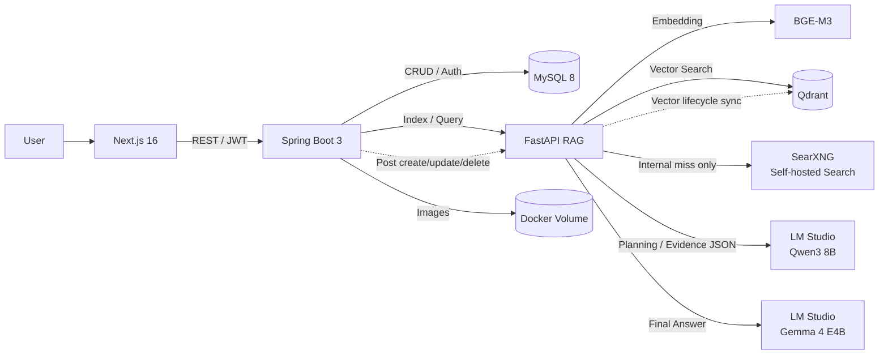
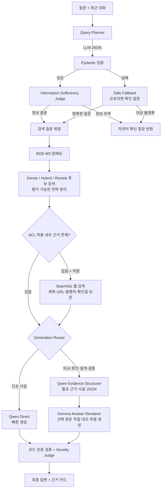

[시연영상](https://youtu.be/NUAwoeLsOvA)
# Knowledge Hub

> 로컬 LLM 기반 근거 검증형 지식 RAG 플랫폼  
> 직접 작성한 기술 게시물을 지식 자산으로 축적하고, 질문 의도를 해석해 원문 근거와 함께 답변하는 풀스택 프로젝트입니다.

## 한눈에 보기

AI·소프트웨어·제조 등 여러 기술과 학습 주제로 쌓인 글은 많아졌지만, 필요한 내용을 다시 찾고 여러 글의 정보를 연결하는 데 시간이 걸렸습니다. 일반적인 LLM에 바로 질문하면 답은 자연스럽지만, 내 자료에서 나온 내용인지 확인하기 어렵다는 문제도 있었습니다.

이 프로젝트는 게시글의 생성·수정·삭제와 벡터 인덱스를 동기화하고, 검색된 원문만으로 답변을 생성·검증합니다. 단순 벡터 검색을 넘어 최근 대화에서 생략된 대상을 복원하고, 질문 유형에 맞는 판단 규칙을 적용하도록 RAG 파이프라인을 모듈화했습니다.

| 구분 | 내용 |
|---|---|
| 진행 기간 | 2026.08.28 ~ 진행 중 (1인 개인 프로젝트) |
| 개발 범위 | 기획, UI, 프런트엔드, 백엔드, RAG 파이프라인, 데이터 모델링, 로컬 배포 |
| 핵심 가치 | 개인 기술 문서를 검색 가능한 지식으로 전환하고 답변의 출처를 원문까지 연결 |
| AI 실행 방식 | BGE-M3 임베딩 + Qdrant 검색 + LM Studio 로컬 LLM |
| 서비스 구성 | Next.js, Spring Boot, FastAPI, MySQL, Qdrant, SearXNG를 Docker Compose로 통합 |
| 현재 상태 | 게시글 CRUD·자동 색인·조건부 생성 RAG·내부 검색 실패 시 웹 보강·50문항 검색 평가·근거 기반 학습 방향·인증/권한·이미지 관리 구현 |

## 핵심 기능

### 1. 게시글과 벡터 인덱스의 생명주기 동기화

- 게시글 등록 후 본문을 의미 단위로 분할하고 Qdrant에 자동 색인합니다.
- 수정 시 기존 청크를 먼저 제거하고 다시 색인해 중복 벡터를 방지합니다.
- 삭제 시 MySQL 원문과 연결된 Qdrant 청크도 함께 제거합니다.
- MySQL은 원본 저장소, Qdrant는 재생성 가능한 검색 인덱스로 역할을 구분했습니다.

### 2. 대화 문맥을 이해하는 RAG

- 최근 대화 6개를 이용해 “그건 왜 그런 거야?”와 같은 생략된 후속 질문의 대상을 복원합니다. 문맥으로 확정할 수 없으면 추측해서 검색하지 않습니다.
- 질문을 사실 조회, 비교, 원인 분석, 트러블슈팅, 설계 제안, 신규성 판단, 검증 계획의 7가지 의도로 분류합니다.
- LLM 분석 결과를 Pydantic 스키마로 검증하고, 모호한 표현·확인이 필요한 이유·사용자에게 물을 문장을 구조화된 JSON으로 관리합니다.
- 내부 JSON 키나 변수명은 화면에 노출하지 않고, 모호한 실제 표현을 짚은 자연어 확인 질문만 반환합니다.
- LLM 분석 자체가 실패해도 질문이 명확하면 원문 검색을 유지하고, 대명사처럼 대상이 모호하면 Safe Fallback이 검색을 중단합니다.
- 정보가 부족해 답변 방향이 달라질 때만 추가 질문을 요청합니다.

### 3. 근거 중심 답변 생성

- 최소 유사도 미만의 검색 결과와 중복 청크를 제거합니다.
- 한 게시글이 검색 결과를 독점하지 않도록 출처별 최대 1개 청크만 채택합니다.
- 단순 사실 질문은 Qwen3 8B가 직접 작성하고, 비교·원인·트러블슈팅·설계·신규성·검증 질문은 Qwen이 근거를 구조화한 뒤 Gemma 4 E4B가 최종 답변을 생성합니다.
- 요청에서 `qwen_direct` 또는 `hierarchical`을 지정하면 자동 선택을 우회할 수 있어 동일 조건 A/B 평가가 가능합니다.
- 최종 단계에서는 모델 재작성 대신 코드가 인용 번호와 출처 존재 여부를 검증합니다.
- 사실 주장이 포함된 답변 블록에는 `[근거 N]`을 유지하고, 근거 카드에서 원문 게시글로 이동할 수 있습니다.
- 권한 필터를 통과한 내부 근거가 0건이면 자체 호스팅 SearXNG로 웹을 검색하고, 같은 생성·인용 검증 경로에서 답변합니다. 요청의 `allow_web_search=false`로 끌 수 있습니다.
- 웹 근거 카드는 제목·URL·발행처·확인 날짜를 보존하며, 검색 결과의 요약문 범위를 넘어선 내용을 확인된 사실처럼 확장하지 않도록 프롬프트를 제한합니다.
- 설계 질문에서는 구성 요소 조합을 `새 아키텍처`, 계산·학습·업데이트 규칙의 변화를 `새 알고리즘 후보`로 구분합니다.

### 4. 운영 가능한 콘텐츠 플랫폼

- Spring Security와 JWT를 이용해 비로그인·일반 사용자·관리자 권한을 분리했습니다.
- TipTap 편집기에서 문단, 제목, 목록, 인용, 표, 이미지 블록을 작성할 수 있습니다.
- 게시 시 제목 생성, 원문 기반 요약, 핵심 내용, 학습 방향, 주제 분류를 지원합니다.
- 이미지의 MIME 형식과 실제 디코딩 결과를 확인하고 UUID 파일명과 경로 검증으로 안전하게 저장합니다.
- 사용자가 명시적으로 저장한 AI 대화만 개인별로 보관하며 RAG 색인 대상에서는 제외합니다.

### 5. 내부 자료 우선 학습 방향 추천

- 게시물 저장과 분리된 `근거 기반 학습 방향 찾기` 버튼에서만 후속 검색을 실행합니다.
- 로컬 LLM이 본문에 이미 충분히 설명된 주제를 제외하고 선행 지식·심화 개념·검증 실습 후보를 만듭니다.
- 후보별로 현재 게시물을 제외한 내부 게시글을 Hybrid Search와 Cross-Encoder reranker로 먼저 검색합니다.
- 내부 자료가 없을 때만 자체 호스팅 SearXNG를 사용하며 공식 문서·논문·표준기관 도메인을 우선 정렬합니다.
- 내부·웹 출처가 모두 없으면 사실로 단정하지 않고 `추천 아이디어`로 표시합니다.
- 웹 근거는 제목, URL, 발행처, UTC 확인 날짜를 반환하고 브라우저에 보존합니다.
- 완료한 항목은 안정적인 항목 ID로 저장하며, 재생성 결과에서 사라져도 체크된 기존 항목은 유지합니다.

## 시스템 아키텍처



모든 브라우저 요청은 Spring Boot를 경유합니다. 인증·비즈니스 규칙은 Spring이 담당하고, FastAPI는 임베딩·검색·LLM 오케스트레이션에 집중하도록 경계를 나눴습니다.

## RAG 처리 흐름



### 모호한 질문을 처리하는 방식

Query Planner는 답변을 생성하지 않고 질문을 분석한 JSON만 만듭니다. 다음 정보는 서버 내부 판정에만 사용됩니다.

```json
{
  "needs_clarification": true,
  "ambiguities": [
    {
      "ambiguous_text": "그건",
      "reason": "대화만으로 가리키는 대상을 확정할 수 없음",
      "question_to_user": "'그건'이 어떤 기술이나 내용을 가리키는지 알려주시겠어요?"
    }
  ]
}
```

사용자 화면에는 JSON이나 `ambiguous_text` 같은 내부 이름을 보여주지 않습니다.

```text
사용자: 그건 왜 그런 거야?
AI: '그건'이 어떤 기술이나 내용을 가리키는지 알려주시겠어요?
    대상의 이름을 함께 적어주시면 정확히 찾아볼게요.
```

이 응답에는 검색 결과와 출처를 붙이지 않습니다. 사용자가 대상을 명확히 한 다음 질문부터 RAG 검색을 수행합니다.

RAG 로직을 다음 서비스로 분리해 검색, 판정, 표현을 독립적으로 개선할 수 있게 구성했습니다.

```text
rag-fastapi/app/services/
├── query_planner.py       # 질문 의도·문맥·하위 작업 분석
├── information_sufficiency.py # 검색 전 정보 충족도 판정
├── evidence_retriever.py  # 후보 검색·점수 필터·출처 다양성
├── retrieval_strategies.py # BM25·RRF·Cross-Encoder 검색 전략
├── generation_router.py   # 질문 구조·종합·판단 요구 기반 생성 경로 선택
├── evidence_structurer.py # Qwen 기반 필요 근거·사실 JSON 구조화
├── evaluation_report.py   # 최신 golden 평가 결과 제공
├── learning_recommender.py # 내부 우선 후속 학습 주제·근거 연결
├── web_search.py          # 로컬 SearXNG 검색·원출처 우선 정렬
├── claim_judge.py         # 최종 인용 형식의 결정론적 검증
├── novelty_judge.py       # 아키텍처/알고리즘 신규성 판정 정책
├── answer_renderer.py     # Gemma 기반 최종 자연어 답변 생성
├── vector_store.py        # Qdrant 컬렉션·벡터 저장·검색
└── rag_service.py         # 전체 파이프라인 오케스트레이션
```

## 주요 문제 해결 경험

| 문제 | 원인 분석 | 적용한 해결책 | 결과 |
|---|---|---|---|
| 후속 질문의 검색 정확도 저하 | 대명사와 생략된 대상이 검색어에 반영되지 않음 | 최근 대화 기반 `resolved_query`, 모호성 JSON, 자연어 확인 질문, Safe Fallback | 문맥으로 복원하거나 검색 전 사용자에게 대상을 확인 |
| 답변은 자연스럽지만 근거가 약함 | 생성 모델이 관련 문장을 직접 근거처럼 확대 해석 | Qwen 근거 구조화, Gemma 원문 대조 생성, 코드 인용 검증 | 근거 선택과 최종 표현의 책임 분리 |
| 검색 전략을 감으로 선택 | dense·BM25·reranker의 품질/지연 비용을 같은 기준으로 비교할 수 없음 | 50문항 golden set, Recall@K·MRR·지연 측정, 검색 전략 A/B | 현재 데이터에서는 dense Hit@K 0.90으로 기본값 유지 |
| 파이프라인 변경 후 과거 실패 재발 | 실패 사례와 요청 단계가 별도 기록되지 않음 | 실패 자동 회귀 등록, 단계별 trace, 평가 대시보드 | 결과·지연·실패 원인을 요청 단위로 확인 |
| 동일 게시글 청크가 결과를 독점 | 유사한 인접 청크의 점수가 함께 높게 계산됨 | 후보를 넓게 조회한 뒤 중복 제거, 출처별 1개 청크 제한 | 여러 게시글을 비교할 수 있는 근거 구성 |
| 수정 후 과거 내용이 계속 검색됨 | 원문과 벡터 저장소의 생명주기 불일치 | 재색인 전 기존 source 청크 삭제, 삭제 API 연동 | 게시글 상태와 검색 인덱스 일관성 확보 |
| RAG 재배포 직후 `Connection refused` | Spring의 Docker DNS 캐시에 이전 컨테이너 IP가 남음 | RAG health check, DNS TTL 5초, 지수 백오프 재시도 | RAG 준비 후 Spring 시작 및 주소 자동 갱신 |
| 이미지 삭제 중 공유 파일 손실 위험 | 한 이미지를 여러 게시글이 참조할 수 있음 | DB 커밋 후 미참조 UUID 파일만 삭제 | 데이터 롤백과 파일 삭제 시점 분리 |

## 기술 스택

| 영역 | 기술 | 선택 이유 |
|---|---|---|
| Frontend | Next.js 16, React 19, TypeScript 5, Tailwind CSS 4, TipTap 3 | 서버/클라이언트 UI 구성과 타입 안전한 콘텐츠 편집 |
| Backend | Java 17, Spring Boot 3.2, Spring Security, MyBatis | 인증·권한·트랜잭션 중심의 비즈니스 API 구성 |
| AI/RAG | Python, FastAPI, Pydantic 2, Sentence Transformers | 모델 연동과 검색 파이프라인을 빠르게 실험하고 검증 |
| Embedding | BGE-M3 | 한국어와 기술 문서 검색을 위한 다국어 임베딩 |
| Local LLM | LM Studio, Qwen3 8B, Gemma 4 E4B | 단순 질의는 Qwen 직접 생성, 복잡 질의는 Qwen 구조화→Gemma 생성으로 비용과 품질을 조절 |
| Storage | MySQL 8, Qdrant | 원본 관계형 데이터와 검색용 벡터 데이터의 책임 분리 |
| Infra | Docker Compose, SearXNG, NVIDIA GPU | 6개 서비스를 재현 가능한 단일 실행 환경으로 통합 |

## 데이터 흐름

### 게시글 등록

```text
사용자 작성
  → Spring 입력값·권한 검증
  → FastAPI 원문 기반 요약/분류
  → MySQL 원문 저장
  → 의미 단위 청킹 및 BGE-M3 임베딩
  → Qdrant 색인
  → 게시글에 색인 상태 반영
```

### 지식 질문

```text
질문과 대화 이력
  → 의도·질문 구조 분석 및 독립 질문 복원
  → 벡터 후보 검색
  → 직접 조회: Qwen 직접 생성
  → 종합·판단: Qwen 근거 JSON 구조화 후 Gemma 최종 생성
  → 코드 기반 인용 검증
  → 답변과 클릭 가능한 출처 반환
```

## 프로젝트 구조

```text
blogProject/
├── frontend-nextjs/              # Next.js 프런트엔드
├── backend-spring/               # Spring Boot 비즈니스 API
├── rag-fastapi/                  # FastAPI RAG 엔진
├── docker/mysql/init.sql         # MySQL 초기 스키마
├── 게시물/                        # 프로젝트 작성에 사용한 지식 원문
├── docker-compose.yml            # 전체 서비스 오케스트레이션
├── start-blog.ps1                # Docker·LM Studio·모델 자동 실행
├── FEATURES.md                   # 상세 기능 명세
└── OPERATIONS.md                 # 운영 및 장애 대응 가이드
```

## 실행 방법

### 요구 환경

- Windows 10/11 + PowerShell
- Docker Desktop 및 WSL2
- NVIDIA GPU와 Docker GPU 접근 환경
- LM Studio CLI
- LM Studio에서 사용할 `qwen/qwen3-8b`, `google/gemma-4-e4b` 모델

### 1. 환경변수 준비

```powershell
Copy-Item .env.example .env
```

`.env`에서 데이터베이스 계정, JWT 비밀키, 내부 서비스 주소, 포트를 로컬 환경에 맞게 설정합니다. 실제 `.env`는 저장소에 커밋하지 않습니다.

### 2. 원클릭 실행

```powershell
powershell -ExecutionPolicy Bypass -File .\start-blog.ps1
```

스크립트가 다음 작업을 순서대로 수행합니다.

1. Docker Desktop 실행 및 준비 확인
2. LM Studio API 서버 실행
3. Qwen3 8B Planner와 Gemma 4 E4B Answer 모델 로드
4. Docker Compose 전체 서비스 실행
5. 백엔드와 프런트엔드 응답 확인
6. `http://localhost:3000` 열기

### 3. 수동 실행

```powershell
docker compose up -d --build
docker compose ps
```

상세 운영 방법과 장애 대응은 [OPERATIONS.md](./OPERATIONS.md)를 참고하세요.

> 데이터 보존이 필요하면 `docker compose down -v`를 사용하지 마세요. MySQL, Qdrant, 업로드 이미지 볼륨이 함께 삭제될 수 있습니다.

## 주요 API

| Method | Endpoint | 설명 | 권한 |
|---|---|---|---|
| `POST` | `/api/auth/register` | 회원가입 | Public |
| `POST` | `/api/auth/login` | JWT 발급 | Public |
| `GET` | `/api/posts` | 게시글 목록 | Public |
| `POST` | `/api/posts` | 게시글 작성 및 자동 색인 | User / Admin |
| `PUT` | `/api/posts/{id}` | 게시글 수정 및 재색인 | Admin |
| `DELETE` | `/api/posts/{id}` | 게시글·벡터·미참조 이미지 삭제 | Admin |
| `POST` | `/api/rag/query` | 근거 기반 질의응답 | Public |
| `POST` | `/api/rag/learning-directions/{postId}` | 내부 우선 근거 기반 후속 학습 방향 검색 | Public, 문서 ACL 적용 |
| `GET` | `/api/rag/evaluation/latest` | 최신 Golden 평가 결과 | Admin |
| `POST` | `/api/posts/{id}/reindex` | 수동 재색인 | Admin |
| `POST` | `/api/uploads/images` | 검증된 이미지 업로드 | User / Admin |
| `GET/POST/PUT/DELETE` | `/api/conversations` | 사용자별 AI 대화 관리 | Authenticated |

## 검증한 항목

- Next.js production build 및 TypeScript 검사 통과
- Spring Boot Gradle build 통과
- FastAPI 모듈 구문 검사 및 컨테이너 기동 확인
- Docker Compose 6개 서비스와 RAG·SearXNG health check 확인 필요
- Spring → FastAPI → Qdrant → LM Studio 전체 질의 경로에서 `200 OK` 확인
- 게시글별 출처 다양성, 연속 질문의 문맥 복원, 근거 카드 원문 연결 확인
- RAG health check 기반 시작 순서와 Spring DNS TTL·연결 재시도 설정 확인

### Golden 50문항 검색 평가

"Cross-Encoder를 넣으면 좋아질 것"이라는 가정을 확인하기 위해 비교 기준부터 만들었습니다. Golden set은 대표 기술 질문 40개, 문서에 근거가 없는 질문 5개, 확인 질문·일반 대화 5개로 구성하고 각 문항에 기대 의도·정답 출처 ID·필수 개념을 붙였습니다.

| 검색 전략 | Hit@K | Recall@K | MRR | 평균 검색 지연 |
|---|---:|---:|---:|---:|
| **dense (채택)** | **0.900** | **0.900** | **0.890** | 31.6ms |
| hybrid (BM25 + RRF) | 0.860 | 0.860 | 0.850 | 25.5ms |
| hybrid + Cross-Encoder | 0.860 | 0.860 | 0.840 | 5,335.2ms |

Cross-Encoder는 품질이 오르지 않으면서 검색 지연만 약 170배(31.6ms → 5,335ms) 늘어 채택하지 않고 dense를 기본값으로 유지했습니다. 측정 과정에서 hybrid의 Hit@K가 `0.20`으로 무너지는 버그도 발견했는데, 코사인 유사도용 최소 점수를 값의 범위가 다른 RRF·Cross-Encoder 점수에 그대로 적용한 것이 원인이었습니다. 특정 질문 예외 처리 대신 점수 체계별로 임계값 의미를 분리했습니다. 실패 문항은 회귀 목록에 자동 등록되며 최신 평가 기준 18건입니다.

### Golden 50문항 생성 평가

2026-09-04에 동일한 Golden 50문항, dense 검색, `top_k=4`, 경로별 문항당 1회 조건으로 측정했습니다. 자동 지표는 정답 출처·필수 개념·기대 동작·근거 문단·인용 번호를 검사하며, 사람 평가를 대체하지 않습니다.

| 생성 경로 | 통과율 | 정확성 | 근거 문단 | 인용 유효성 | 평균 지연 |
|---|---:|---:|---:|---:|---:|
| Qwen 직접 | 82% | 87.0% | 89.3% | 100% | 21.3초 |
| Qwen→Gemma 계층형 | 94% | 93.8% | 81.0% | 100% | 33.4초 |
| Auto 혼합 | 88% | 89.6% | 84.0% | 100% | 25.8초 |

Auto의 정책 기준 경로 일치율은 74%, intent·질문 구조 일치율은 각각 70%였습니다. 정책상 계층형이어야 하지만 직접 경로를 선택한 사례 11건, 불필요한 계층형 1건, 재질문 우회 실패 1건이 확인됐습니다. 다만 잘못된 직접 경로 11건은 이번 자동 지표에서는 모두 통과했으므로, 이 수치는 최적 경로의 정답률이 아니라 현재 라우팅 정책과의 일치율입니다. 상세 구조별 결과와 실패 문항은 관리자 `RAG Evaluation` 화면에서 확인할 수 있습니다.

현재 기본 경로는 Auto로 유지합니다. 50문항 1회 평가에서 Auto는 직접 경로보다 통과율이 6%p 높고 평균 4.5초 느렸으며, 전체 계층형보다 통과율이 6%p 낮고 평균 7.7초 빨랐습니다. 따라서 최고 품질 경로라고 단정하지 않고 **현재 로컬 환경에서 품질과 응답 시간의 절충안**으로 선택했습니다.

## 설계 원칙과 트레이드오프

### Groundedness over fluency

답변의 화려함보다 원문에서 확인할 수 있는 범위를 우선했습니다. 이 때문에 검색 근거가 부족하면 답변이 짧아질 수 있지만, 기술 지식 서비스에서는 검증 가능성이 더 중요하다고 판단했습니다.

### Local-first AI

기술 원문을 외부 API로 전송하지 않도록 로컬 LLM을 선택했습니다. 데이터 통제권을 확보한 대신, 현재 개발 환경에서 생성 경로에 따라 질문당 평균 21~33초(Auto 25.8초)가 소요됩니다. 모델 호출 축소와 캐싱이 다음 성능 개선 과제입니다.

웹 보강은 API 키가 필요한 외부 검색 API를 사용하지 않고 내부 Docker 네트워크의 SearXNG를 호출합니다. 다만 SearXNG가 검색 엔진에 요청할 때 일반 RAG 검색어 또는 학습 주제 검색어는 외부 네트워크로 전달됩니다. 게시물 본문 전체와 대화 전체는 검색 엔진으로 보내지 않습니다.

SearXNG 컨테이너 구성은 [공식 Docker 설치 문서](https://docs.searxng.org/admin/installation-docker.html)의 단일 인스턴스 방식을 따르며, 웹 UI 포트는 호스트에 공개하지 않습니다.

### Source of truth 분리

MySQL만 원본 데이터로 취급하고 Qdrant는 언제든 재구축할 수 있는 파생 인덱스로 설계했습니다. 두 저장소를 분산 트랜잭션으로 묶는 대신 재색인과 상태 필드로 최종 일관성을 관리합니다.

## 현재 한계

- 인용 번호가 존재하더라도 문장 전체의 의미가 원문과 완전히 일치하는지는 추가 검증이 필요합니다.
- 50문항 생성 평가는 경로별 문항당 1회 실행이므로 모델 출력 변동성과 일반적인 품질 우위를 확정하기에는 표본 반복이 부족합니다.
- Cross-Encoder는 현재 CPU 환경에서 평균 5.3초의 검색 지연을 추가하고 dense보다 낮은 Hit@K를 보여 기본 경로에서 제외했습니다.
- Auto 라우팅은 정책 기준 경로 일치율 74%로, 비교·인과 질문 11건을 직접 조회로 축소하고 모호한 설계 질문 1건을 재질문하지 못한 한계가 있습니다.
- PDF 업로드·페이지 단위 출처·OCR 파이프라인은 로드맵 단계입니다.
- 현재 실행 스크립트와 GPU 설정은 Windows + NVIDIA 환경에 최적화되어 있습니다.
- 근거 기반 학습 방향의 체크·검색 결과는 현재 브라우저 localStorage에 보존되므로 다른 기기와 계정 동기화되지 않습니다.
- 학습 방향 정책 테스트는 내부 우선·웹 fallback·인용 구조를 검증하지만, 추천 주제의 교육적 품질은 아직 사람 평가 표본으로 검증하지 않았습니다.
- 일반 RAG의 웹 fallback은 현재 내부 검색 후보가 0건일 때만 실행합니다. 내부 후보는 있으나 구조화 단계에서 모두 기각되거나 부분 근거만 남은 경우의 2차 웹 보강은 아직 지원하지 않습니다.
- 웹 답변은 SearXNG 결과의 제목과 요약문을 근거로 하며 원문 페이지 본문을 직접 검증하지 않으므로, 중요한 사실은 연결된 원출처를 다시 확인해야 합니다.

## 다음 개선 계획

1. 주장 단위 JSON 판정과 인용 entailment 검사
2. 대표 10~20문항 블라인드 사람 평가로 자동 지표와 실제 유용성의 상관관계 검증
3. 질문 형식이 아니라 실제 근거 결합 난이도를 LLM이 판단하는 라우팅과 품질·지연 기반 경로 평가 실험
4. 낮은 분류 신뢰도, 직접 생성 검증 실패, 근거 부족을 구분하는 조건부 fallback 설계
5. Query Planner 결과 캐싱과 조건부 LLM 호출로 응답 시간 단축
6. 실패 사례의 승인·버전 관리와 CI 회귀 평가 연결
7. PDF 구조 인식, OCR, 페이지 단위 출처 제공
8. 범용 개념·문서 관계를 활용한 GraphRAG 확장 및 제조 공정·장비 관계를 초기 사례로 평가

## 문서

- [상세 기능 명세](./FEATURES.md)
- [실행 및 운영 가이드](./OPERATIONS.md)
- [LLM/RAG 발전 과정](./LLM_EVOLUTION.md)
- [개발 로드맵](./Task.md)

---

이 프로젝트는 “LLM을 연결하는 것”에서 끝나지 않고, 검색 품질·근거 검증·데이터 일관성·장애 복구를 하나의 제품 흐름으로 설계하는 데 초점을 맞췄습니다.
