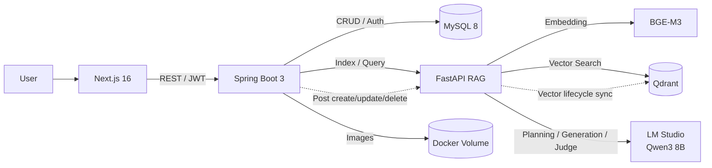
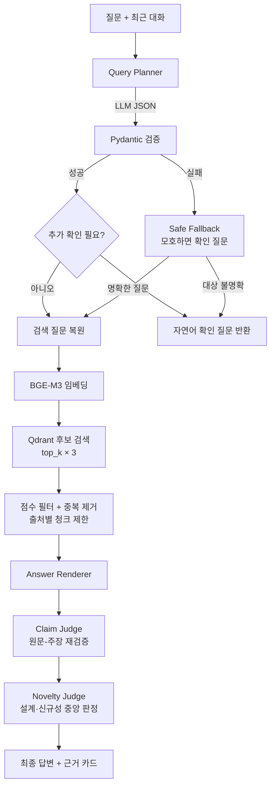

# Knowledge Hub

> 로컬 LLM 기반 근거 검증형 제조 지식 RAG 플랫폼  
> 직접 작성한 기술 게시물을 지식 자산으로 축적하고, 질문 의도를 해석해 원문 근거와 함께 답변하는 풀스택 프로젝트입니다.

## 한눈에 보기

제조·AI 기술을 공부하며 쌓인 글은 많아졌지만, 필요한 내용을 다시 찾고 여러 글의 정보를 연결하는 데 시간이 걸렸습니다. 일반적인 LLM에 바로 질문하면 답은 자연스럽지만, 내 자료에서 나온 내용인지 확인하기 어렵다는 문제도 있었습니다.

이 프로젝트는 게시글의 생성·수정·삭제와 벡터 인덱스를 동기화하고, 검색된 원문만으로 답변을 생성·검증합니다. 단순 벡터 검색을 넘어 최근 대화에서 생략된 대상을 복원하고, 질문 유형에 맞는 판단 규칙을 적용하도록 RAG 파이프라인을 모듈화했습니다.

| 구분 | 내용 |
|---|---|
| 개발 범위 | 기획, UI, 프런트엔드, 백엔드, RAG 파이프라인, 데이터 모델링, 로컬 배포 |
| 핵심 가치 | 개인 기술 문서를 검색 가능한 지식으로 전환하고 답변의 출처를 원문까지 연결 |
| AI 실행 방식 | BGE-M3 임베딩 + Qdrant 검색 + LM Studio 로컬 LLM |
| 서비스 구성 | Next.js, Spring Boot, FastAPI, MySQL, Qdrant를 Docker Compose로 통합 |
| 현재 상태 | 게시글 CRUD·자동 색인·근거 기반 질의응답·대화 저장·인증/권한·이미지 관리 구현 |

## 핵심 기능

### 1. 게시글과 벡터 인덱스의 생명주기 동기화

- 게시글 등록 후 본문을 의미 단위로 분할하고 Qdrant에 자동 색인합니다.
- 수정 시 기존 청크를 먼저 제거하고 다시 색인해 중복 벡터를 방지합니다.
- 삭제 시 MySQL 원문과 연결된 Qdrant 청크도 함께 제거합니다.
- MySQL은 원본 저장소, Qdrant는 재생성 가능한 검색 인덱스로 역할을 구분했습니다.

### 2. 대화 문맥을 이해하는 RAG

- 최근 대화 6개를 이용해 “그건 왜 그런 거야?”와 같은 생략된 후속 질문의 대상을 복원합니다. 문맥으로 확정할 수 없으면 추측해서 검색하지 않습니다.
- 질문을 사실 조회, 비교, 원인 분석, 트러블슈팅, 설계 제안, 신규성 판단, 검증 계획의 7가지 의도로 분류합니다.
- LLM 분석 결과를 Pydantic 스키마로 검증하고, 모호한 표현·확인이 필요한 이유·사용자에게 물을 문장을 구조화된 JSON으로 관리합니다.
- 내부 JSON 키나 변수명은 화면에 노출하지 않고, 모호한 실제 표현을 짚은 자연어 확인 질문만 반환합니다.
- LLM 분석 자체가 실패해도 질문이 명확하면 원문 검색을 유지하고, 대명사처럼 대상이 모호하면 Safe Fallback이 검색을 중단합니다.
- 정보가 부족해 답변 방향이 달라질 때만 추가 질문을 요청합니다.

### 3. 근거 중심 답변 생성

- 최소 유사도 미만의 검색 결과와 중복 청크를 제거합니다.
- 한 게시글이 검색 결과를 독점하지 않도록 출처별 최대 1개 청크만 채택합니다.
- 초안 생성 후 별도의 Claim Judge가 원문과 주장을 다시 대조합니다.
- 사실 주장이 포함된 답변 블록에는 `[근거 N]`을 유지하고, 근거 카드에서 원문 게시글로 이동할 수 있습니다.
- 설계 질문에서는 구성 요소 조합을 `새 아키텍처`, 계산·학습·업데이트 규칙의 변화를 `새 알고리즘 후보`로 구분합니다.

### 4. 운영 가능한 콘텐츠 플랫폼

- Spring Security와 JWT를 이용해 비로그인·일반 사용자·관리자 권한을 분리했습니다.
- TipTap 편집기에서 문단, 제목, 목록, 인용, 표, 이미지 블록을 작성할 수 있습니다.
- 게시 시 제목 생성, 원문 기반 요약, 핵심 내용, 학습 방향, 주제 분류를 지원합니다.
- 이미지의 MIME 형식과 실제 디코딩 결과를 확인하고 UUID 파일명과 경로 검증으로 안전하게 저장합니다.
- 사용자가 명시적으로 저장한 AI 대화만 개인별로 보관하며 RAG 색인 대상에서는 제외합니다.

## 시스템 아키텍처



모든 브라우저 요청은 Spring Boot를 경유합니다. 인증·비즈니스 규칙은 Spring이 담당하고, FastAPI는 임베딩·검색·LLM 오케스트레이션에 집중하도록 경계를 나눴습니다.

## RAG 처리 흐름



### 모호한 질문을 처리하는 방식

Query Planner는 답변을 생성하지 않고 질문을 분석한 JSON만 만듭니다. 다음 정보는 서버 내부 판정에만 사용됩니다.

```json
{
  "needs_clarification": true,
  "ambiguities": [
    {
      "ambiguous_text": "그건",
      "reason": "대화만으로 가리키는 대상을 확정할 수 없음",
      "question_to_user": "'그건'이 어떤 기술이나 내용을 가리키는지 알려주시겠어요?"
    }
  ]
}
```

사용자 화면에는 JSON이나 `ambiguous_text` 같은 내부 이름을 보여주지 않습니다.

```text
사용자: 그건 왜 그런 거야?
AI: '그건'이 어떤 기술이나 내용을 가리키는지 알려주시겠어요?
    대상의 이름을 함께 적어주시면 정확히 찾아볼게요.
```

이 응답에는 검색 결과와 출처를 붙이지 않습니다. 사용자가 대상을 명확히 한 다음 질문부터 RAG 검색을 수행합니다.

RAG 로직을 다음 서비스로 분리해 검색, 판정, 표현을 독립적으로 개선할 수 있게 구성했습니다.

```text
rag-fastapi/app/services/
├── query_planner.py       # 질문 의도·문맥·하위 작업 분석
├── evidence_retriever.py  # 후보 검색·점수 필터·출처 다양성
├── claim_judge.py         # 생성 문장과 원문 근거 대조
├── novelty_judge.py       # 아키텍처/알고리즘 신규성 판정 정책
├── answer_renderer.py     # 의도별 자연어 답변 생성
└── rag_service.py         # 전체 파이프라인 오케스트레이션
```

## 주요 문제 해결 경험

| 문제 | 원인 분석 | 적용한 해결책 | 결과 |
|---|---|---|---|
| 후속 질문의 검색 정확도 저하 | 대명사와 생략된 대상이 검색어에 반영되지 않음 | 최근 대화 기반 `resolved_query`, 모호성 JSON, 자연어 확인 질문, Safe Fallback | 문맥으로 복원하거나 검색 전 사용자에게 대상을 확인 |
| 답변은 자연스럽지만 근거가 약함 | 생성 모델이 관련 문장을 직접 근거처럼 확대 해석 | 초안과 검증 모델 역할 분리, 인용 블록 필터, 중앙 판정 정책 | 근거·추론·제안의 표현 범위를 통제 |
| 동일 게시글 청크가 결과를 독점 | 유사한 인접 청크의 점수가 함께 높게 계산됨 | 후보를 넓게 조회한 뒤 중복 제거, 출처별 1개 청크 제한 | 여러 게시글을 비교할 수 있는 근거 구성 |
| 수정 후 과거 내용이 계속 검색됨 | 원문과 벡터 저장소의 생명주기 불일치 | 재색인 전 기존 source 청크 삭제, 삭제 API 연동 | 게시글 상태와 검색 인덱스 일관성 확보 |
| RAG 재배포 직후 `Connection refused` | Spring의 Docker DNS 캐시에 이전 컨테이너 IP가 남음 | RAG health check, DNS TTL 5초, 지수 백오프 재시도 | RAG 준비 후 Spring 시작 및 주소 자동 갱신 |
| 이미지 삭제 중 공유 파일 손실 위험 | 한 이미지를 여러 게시글이 참조할 수 있음 | DB 커밋 후 미참조 UUID 파일만 삭제 | 데이터 롤백과 파일 삭제 시점 분리 |

## 기술 스택

| 영역 | 기술 | 선택 이유 |
|---|---|---|
| Frontend | Next.js 16, React 19, TypeScript 5, Tailwind CSS 4, TipTap 3 | 서버/클라이언트 UI 구성과 타입 안전한 콘텐츠 편집 |
| Backend | Java 17, Spring Boot 3.2, Spring Security, MyBatis | 인증·권한·트랜잭션 중심의 비즈니스 API 구성 |
| AI/RAG | Python, FastAPI, Pydantic 2, Sentence Transformers | 모델 연동과 검색 파이프라인을 빠르게 실험하고 검증 |
| Embedding | BGE-M3 | 한국어와 기술 문서 검색을 위한 다국어 임베딩 |
| Local LLM | LM Studio, Qwen3 8B | 외부 API로 원문을 전송하지 않는 로컬 추론 환경 |
| Storage | MySQL 8, Qdrant | 원본 관계형 데이터와 검색용 벡터 데이터의 책임 분리 |
| Infra | Docker Compose, NVIDIA GPU | 5개 서비스를 재현 가능한 단일 실행 환경으로 통합 |

## 데이터 흐름

### 게시글 등록

```text
사용자 작성
  → Spring 입력값·권한 검증
  → FastAPI 원문 기반 요약/분류
  → MySQL 원문 저장
  → 의미 단위 청킹 및 BGE-M3 임베딩
  → Qdrant 색인
  → 게시글에 색인 상태 반영
```

### 지식 질문

```text
질문과 대화 이력
  → 의도 분석 및 독립 질문 복원
  → 벡터 후보 검색과 근거 선별
  → 답변 초안 생성
  → 원문 근거 재검증
  → 답변과 클릭 가능한 출처 반환
```

## 프로젝트 구조

```text
blogProject/
├── frontend-nextjs/              # Next.js 프런트엔드
├── backend-spring/               # Spring Boot 비즈니스 API
├── rag-fastapi/                  # FastAPI RAG 엔진
├── docker/mysql/init.sql         # MySQL 초기 스키마
├── 게시물/                        # 프로젝트 작성에 사용한 지식 원문
├── docker-compose.yml            # 전체 서비스 오케스트레이션
├── start-blog.ps1                # Docker·LM Studio·모델 자동 실행
├── FEATURES.md                   # 상세 기능 명세
└── OPERATIONS.md                 # 운영 및 장애 대응 가이드
```

## 실행 방법

### 요구 환경

- Windows 10/11 + PowerShell
- Docker Desktop 및 WSL2
- NVIDIA GPU와 Docker GPU 접근 환경
- LM Studio CLI
- LM Studio에서 사용할 `qwen/qwen3-8b` 모델

### 1. 환경변수 준비

```powershell
Copy-Item .env.example .env
```

`.env`에서 데이터베이스 계정, JWT 비밀키, 내부 서비스 주소, 포트를 로컬 환경에 맞게 설정합니다. 실제 `.env`는 저장소에 커밋하지 않습니다.

### 2. 원클릭 실행

```powershell
powershell -ExecutionPolicy Bypass -File .\start-blog.ps1
```

스크립트가 다음 작업을 순서대로 수행합니다.

1. Docker Desktop 실행 및 준비 확인
2. LM Studio API 서버 실행
3. Qwen3 8B 모델 로드
4. Docker Compose 전체 서비스 실행
5. 백엔드와 프런트엔드 응답 확인
6. `http://localhost:3000` 열기

### 3. 수동 실행

```powershell
docker compose up -d --build
docker compose ps
```

상세 운영 방법과 장애 대응은 [OPERATIONS.md](./OPERATIONS.md)를 참고하세요.

> 데이터 보존이 필요하면 `docker compose down -v`를 사용하지 마세요. MySQL, Qdrant, 업로드 이미지 볼륨이 함께 삭제될 수 있습니다.

## 주요 API

| Method | Endpoint | 설명 | 권한 |
|---|---|---|---|
| `POST` | `/api/auth/register` | 회원가입 | Public |
| `POST` | `/api/auth/login` | JWT 발급 | Public |
| `GET` | `/api/posts` | 게시글 목록 | Public |
| `POST` | `/api/posts` | 게시글 작성 및 자동 색인 | User / Admin |
| `PUT` | `/api/posts/{id}` | 게시글 수정 및 재색인 | Admin |
| `DELETE` | `/api/posts/{id}` | 게시글·벡터·미참조 이미지 삭제 | Admin |
| `POST` | `/api/rag/query` | 근거 기반 질의응답 | Public |
| `POST` | `/api/posts/{id}/reindex` | 수동 재색인 | Admin |
| `POST` | `/api/uploads/images` | 검증된 이미지 업로드 | User / Admin |
| `GET/POST/PUT/DELETE` | `/api/conversations` | 사용자별 AI 대화 관리 | Authenticated |

## 검증한 항목

- Next.js production build 및 TypeScript 검사 통과
- Spring Boot Gradle build 통과
- FastAPI 모듈 구문 검사 및 컨테이너 기동 확인
- Docker Compose 5개 서비스 실행과 RAG health check 확인
- Spring → FastAPI → Qdrant → LM Studio 전체 질의 경로에서 `200 OK` 확인
- 게시글별 출처 다양성, 연속 질문의 문맥 복원, 근거 카드 원문 연결 확인
- RAG health check 기반 시작 순서와 Spring DNS TTL·연결 재시도 설정 확인

## 설계 원칙과 트레이드오프

### Groundedness over fluency

답변의 화려함보다 원문에서 확인할 수 있는 범위를 우선했습니다. 이 때문에 검색 근거가 부족하면 답변이 짧아질 수 있지만, 기술 지식 서비스에서는 검증 가능성이 더 중요하다고 판단했습니다.

### Local-first AI

기술 원문을 외부 API로 전송하지 않도록 로컬 LLM을 선택했습니다. 데이터 통제권을 확보한 대신, 현재 개발 환경에서 질문당 약 27~45초가 소요됩니다. 모델 호출 축소와 캐싱이 다음 성능 개선 과제입니다.

### Source of truth 분리

MySQL만 원본 데이터로 취급하고 Qdrant는 언제든 재구축할 수 있는 파생 인덱스로 설계했습니다. 두 저장소를 분산 트랜잭션으로 묶는 대신 재색인과 상태 필드로 최종 일관성을 관리합니다.

## 현재 한계

- 인용 번호가 존재하더라도 문장 전체의 의미가 원문과 완전히 일치하는지는 추가 검증이 필요합니다.
- 검색 결과 재순위화를 위한 Cross-Encoder와 정량 평가 데이터셋은 아직 적용하지 않았습니다.
- 로컬 LLM을 세 차례 호출하는 질의는 응답 지연이 큽니다.
- PDF 업로드·페이지 단위 출처·OCR 파이프라인은 로드맵 단계입니다.
- 현재 실행 스크립트와 GPU 설정은 Windows + NVIDIA 환경에 최적화되어 있습니다.

## 다음 개선 계획

1. 주장 단위 JSON 판정과 인용 entailment 검사
2. Cross-Encoder 재순위화 및 검색 품질 평가셋 구축
3. Query Planner 결과 캐싱과 조건부 LLM 호출로 응답 시간 단축
4. 비동기 색인·실패 재처리·관측성 지표 추가
5. PDF 구조 인식, OCR, 페이지 단위 출처 제공
6. 제조 공정·장비·증상·원인·조치 관계를 활용한 GraphRAG 확장

## 문서

- [상세 기능 명세](./FEATURES.md)
- [실행 및 운영 가이드](./OPERATIONS.md)
- [개발 로드맵](./Task.md)

---

이 프로젝트는 “LLM을 연결하는 것”에서 끝나지 않고, 검색 품질·근거 검증·데이터 일관성·장애 복구를 하나의 제품 흐름으로 설계하는 데 초점을 맞췄습니다.
